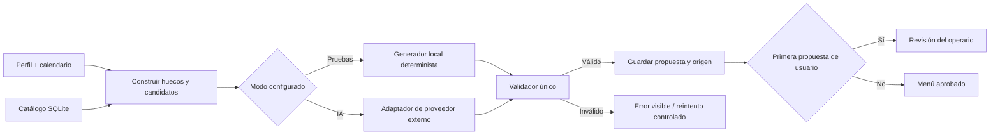

# Generación mensual: modo de pruebas y modo IA

> Diseño original de los dos modos. El adaptador de IA ya está implementado, pero aún requiere una clave y una generación real para verificarlo. Consulta [README.md](../README.md) para activarlo.

Estado: diseño de arquitectura previo al código. Los dos modos se elegirán en el **servidor FastAPI al arrancar**, nunca desde una opción visible que un cliente pueda cambiar. Flutter consultará el modo activo para mostrarlo con claridad.

## 1. Contrato compartido

Ambos generadores recibirán la misma solicitud normalizada:

- Mes y zona horaria `Europe/Madrid`.
- Huecos concretos `{fecha, comida}` creados a partir del calendario semanal del usuario.
- Para cada comida, códigos de platos candidatos ya filtrados por dieta, alérgenos **modelados** e ingredientes excluidos.
- Preferencias explícitas, valoraciones anteriores y apariciones recientes para favorecer variedad.
- Huella de la versión del catálogo y de las restricciones usadas en esa generación.

Ambos devolverán una propuesta con **un código de plato por hueco**, sin datos personales. La propuesta siempre pasa por el mismo validador del backend: cobertura exacta, fecha/comida válidas, códigos existentes y activos, pertenencia al conjunto candidato y política de repeticiones. Si hay cero candidatos, se informa antes de invocar cualquier generador.

La interfaz y la API que consumen clientes y operarios serán las mismas en ambos modos. El generador es la pieza intercambiable; reglas, estados, persistencia y pantallas no se duplican.

## 2. Modo de pruebas

- Valor inicial de configuración: `test`.
- Usa un algoritmo local determinista, sin red ni clave de API. Selecciona entre los candidatos válidos y reparte platos para limitar repeticiones; la misma entrada produce la misma salida.
- Permite probar todo el recorrido: alta, perfil, calendario, primer menú, revisión del operario, semana, sustitución, opinión y nuevo ciclo.
- El backend y Flutter lo identifican siempre como **«Menú de prueba, generado sin IA»**. No servirá como evidencia de que la integración de IA funciona.
- Guarda cuentas y ciclos de prueba en `backend/var/app_test.sqlite`, ignorado por Git.

## 3. Modo IA

- Se activa expresamente con `EASY_EATS_GENERATION_MODE=ai` y un proveedor, modelo y clave definidos en el entorno del servidor. Groq es un candidato considerado, pero el modelo concreto se decidirá y verificará al activar este modo.
- El adaptador envía solo datos alimentarios necesarios y códigos candidatos; **no** envía alias, correo, dirección ni credenciales.
- Pide una respuesta estructurada con `{fecha, comida, recipe_code}`. La API valida la respuesta antes de guardar cualquier menú. Una respuesta incompleta o inventada no se publica.
- Si falta la clave, el servidor sigue disponible para consultar menús ya guardados, pero anuncia `can_generate=false` y rechaza nuevas generaciones con un error de configuración. Si el proveedor no responde o agota sus límites, muestra un error recuperable y conserva el último menú aprobado. **No cambia silenciosamente al generador de pruebas.**
- Registra modo, proveedor, modelo, fecha, huellas de entrada/catálogo, resultado de validación y errores técnicos sin guardar secretos ni datos personales innecesarios.
- Guarda cuentas y ciclos del modo IA en `backend/var/app_ai.sqlite`, ignorado por Git. Por ello, aprobar el primer menú de una cuenta de prueba no cuenta como primera aprobación de una cuenta en modo IA. Al cambiar de modo no se migran perfiles automáticamente: habrá que crear o preparar una cuenta de demostración para el otro entorno.

## 4. Configuración y observabilidad

| Variable de servidor prevista | Función |
| --- | --- |
| `EASY_EATS_GENERATION_MODE` | `test` o `ai`; por defecto `test`. |
| `EASY_EATS_AI_PROVIDER` | Adaptador que se usará en modo IA. |
| `EASY_EATS_AI_MODEL` | Modelo concreto, pendiente de selección al activar la integración. |
| `EASY_EATS_AI_API_KEY` | Secreto local del backend; nunca en Git, Flutter ni URL de petición. |

La API expondrá una capacidad de solo lectura, por ejemplo `GET /system/capabilities`, con `generation_mode`, disponibilidad de generación y etiqueta para la interfaz. El cliente mostrará «Modo de pruebas» o «IA activa» en la zona de menú y revisión. Cada ciclo conservará su origen (`test` o `ai`), incluso si después cambia el modo de arranque.

## 5. Criterios para activar la IA real

El modo IA podrá codificarse y comprobarse con respuestas simuladas de proveedor sin una clave. **La integración real seguirá pendiente** hasta disponer de una clave configurada localmente y verificar una generación mensual completa en la LAN. Antes de usarla en la demo se comprobarán al menos: un mes con días/comidas diferentes, restricciones que reduzcan candidatos, respuesta válida, respuesta inválida y fallo de red/proveedor. La demostración académica que afirme usar IA debe ejecutarse con el modo `ai` activo y mostrar su origen.
